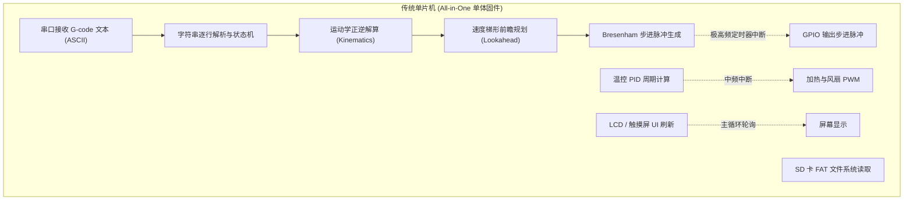
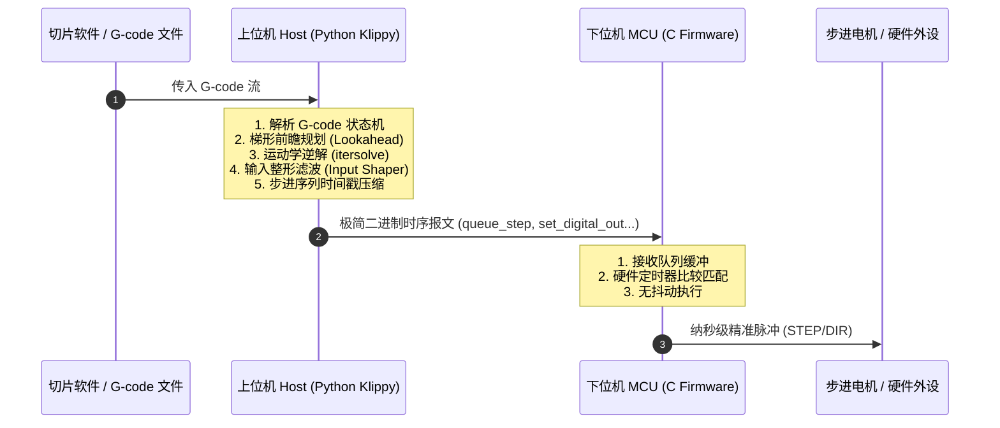

# 1.1 传统固件瓶颈与分布式双脑设计

在深入剖析 Klipper 的底层代码之前，我们必须首先理解一个核心问题：**为什么传统 3D 打印机固件会遇到性能瓶颈？Klipper 的架构究竟颠覆了什么？**

---

## 一、 传统固件的困境：单片机上的“全能超人”

在 Klipper 诞生之前，主流的开源 3D 打印固件（如经典的 Marlin、Repetier 等）大多采用**单体单片机架构（Monolithic Architecture）**。

在单体架构下，一颗微控制器（早期是 16MHz 的 8 位 AVR ATmega2560，后期演进为 72~168MHz 的 32 位 ARM Cortex-M 芯片）需要独揽以下所有工作：



### 1. 难以调和的算力与实时性矛盾
步进电机需要极高频率且**抖动极小（Low Jitter）**的方波脉冲驱动。如果一个电机以 16 微步运行在 200 mm/s，步进频率很容易突破 **100 kHz**（每 10 微秒就必须触发一次定时器中断）。

然而，单片机的主循环里同时还在做：
* 昂贵的双精度/单精度浮点运算（加减速前瞻规划、CoreXY / Delta 坐标变换）。
* 繁琐的文本处理（G-code 指令解析）。
* 耗时的 I/O（读取 SD 卡 FAT 表、刷新 12864 液晶屏）。

当运动频率过高、曲线切片过于精细时，单片机往往因中断频繁抢占而导致主循环饥饿；或者反过来，主循环中的长耗时计算导致定时器中断未能及时响应，造成**丢步、脉冲抖动或打印头停顿卡死（Blobbing）**。

### 2. 算法演进的枷锁
单片机受限于片上 SRAM（通常仅几十 KB 到几百 KB）和 Flash 空间，无法引入更先进的现代控制算法。例如：
* **多段平滑前瞻与高阶 S 曲线加减速** 需要维护庞大的运动块队列与数值求解；
* **输入整形（Input Shaping）** 需要进行实时的卷积滤波甚至频域 FFT 分析；
* **压力提前（Pressure Advance）** 需要在步进层面对挤出轴施加实时速度差分补偿。

要在资源匮乏的单片机上塞进这些算法，代码不仅会变得极其晦涩、到处充斥着位运算与查表 Hack，而且极易触发硬件性能红线。

---

## 二、 Klipper 的破局：分布式双脑模型

Klipper 的核心思想极为纯粹：**将“复杂计算”与“硬实时执行”从物理与逻辑上彻底解耦**。

* **大脑（上位机 Host - Klippy）**：部署在通用微型计算机上（树莓派、香橙派、工控机等）。拥有 GB 级内存和 GHz 级多核处理器，使用表达力丰富、生态庞大的 Python 编写，专注负责高阶运算。
* **小脑（下位机 MCU - Firmware）**：刷入极简的 C 语言微内核固件。不做任何浮点矩阵运算，不解析一行 G-code 文本，只做一件事：**按上位机预先排定的时间表，在精确的硬件时钟周期触发 GPIO 脉冲。**



---

## 三、 软硬分工边界一览

| 模块 / 职责 | 上位机 (Klippy / Python) | 下位机 (MCU Firmware / C) |
| :--- | :--- | :--- |
| **语言与运行环境** | Python 3 + C 加速扩展 (`chelper`)，运行于 Linux | 纯 C 语言，运行于裸机（无 OS / 无 RTOS） |
| **G-code 处理** | 完整解析、参数校验、宏变量（Jinja2 模板）扩展 | **完全不感知** G-code |
| **路径与速度规划** | 前瞻速度规划、拐角速度估算、S 曲线平滑 | **不计算** 速度，只按时间戳走步 |
| **运动学解算** | 负责所有运动学模型（笛卡尔、CoreXY、Delta、多轴旋转） | 只负责单轴脉冲输出 |
| **高级振动抑制** | ADXL345 数据采集、FFT 频谱分析、Input Shaping 冲激滤波 | 仅按整形后的离散脉冲时间表执行 |
| **硬件操作** | 发送带有时钟戳（Clock tick）的底层命令包 | 定时器比较中断、GPIO 电平翻转、ADC/PWM 读写 |

---

## 四、 源码见真章：两端的调度设计

为了直观体会这种设计思想，我们来看上位机与下位机各自的核心主循环入口。

### 1. 上位机：基于 Reactor 事件循环的异步中枢
在上位机入口 [`klippy/klippy.py`](file:///home/zxf/workspace/code/agy/book/klipper/klippy/klippy.py) 中，Klipper 没有为每个任务创建繁重的系统线程，而是自研了一套轻量级的 `Reactor` 事件驱动模型：

```python
# klippy/klippy.py
def run(self):
    systime = time.time()
    monotime = self.reactor.monotonic()
    logging.info("Start printer at %s (%.1f %.1f)",
                 time.asctime(time.localtime(systime)), systime, monotime)
    # 进入反应堆主循环
    try:
        self.reactor.run()
    except:
        msg = "Unhandled exception during run"
        logging.exception(msg)
```

所有的定时任务（如温控检测、状态上报、串口事件监听）都被注册进 `self.reactor`，以微秒级精度的单线程协作式事件循环驱动，保证了高吞吐、低开销。

### 2. 下位机：零 RTOS 的极简微内核
反观下位机 MCU 端，打开 [`src/sched.c`](file:///home/zxf/workspace/code/agy/book/klipper/src/sched.c)，你看不到 FreeRTOS、RT-Thread 等常见的商用嵌入式实时操作系统，而是 Kevin O'Connor 编写的一套令人惊叹的极简定时器队列：

```c
// src/sched.c
static struct timer periodic_timer, sentinel_timer;

static struct {
    struct timer *timer_list, *last_insert;
    int8_t tasks_status, tasks_busy;
    uint8_t shutdown_status, shutdown_reason;
} SchedStatus = {.timer_list = &periodic_timer, .last_insert = &periodic_timer};
```

MCU 固件将所有任务划分为两类：
1. **定时器中断任务（Timers - 硬实时）**：按硬件时钟严格排序的链表。步进电机脉冲的触发完全在硬件定时器中断服务函数（ISR）中完成，代码分支少到可以在几微秒内执行完毕并退出。
2. **普通轮询任务（Tasks - 软实时）**：在无中断发生的主循环中按序轮询处理，例如命令包校验、ADC 采样转换、心跳统计更新。

由于 MCU 不需要负责复杂运算，单片机的 CPU 占用率极低。哪怕是一颗十几元廉价的 8 位 AVR 芯片，在 Klipper 架构下也能轻松输出超过 100,000 steps/s 的平稳步进频率，而 32 位的 STM32 / RP2040 更是可以轻松突破 500,000 steps/s。

---

## 五、 分布式设计的核心代价：时间同步的挑战

天下没有免费的午餐。将“大脑”与“小脑”从物理上拆开到两块板卡之后，Klipper 迎来了一个全新的系统级挑战：

> **上位机的时间与下位机的时间并不一致！**
> 
> 上位机使用的是 Linux 操作系统的单调时钟（以微秒/纳秒为单位），而下位机使用的是片上硬件晶振计数器（Clock ticks，比如 72MHz 或 16MHz）。晶振存在温漂和工艺偏差，且 USB/串口通信存在非确定性的往返延迟（Round-Trip Time, RTT）。
> 
> 上位机如何精准告诉 MCU：“请在未来的第 1.234567 秒，将 PA1 引脚置高”？

为了攻克这一难题，Klipper 设计了一套非常精巧的**分布式时钟同步与漂移补偿算法**。

在下一节中，我们将深入探究 Klipper 自研的高效二进制通信协议，并剖析它是如何在不可靠的串行链路上构建确定性控制基石的。
