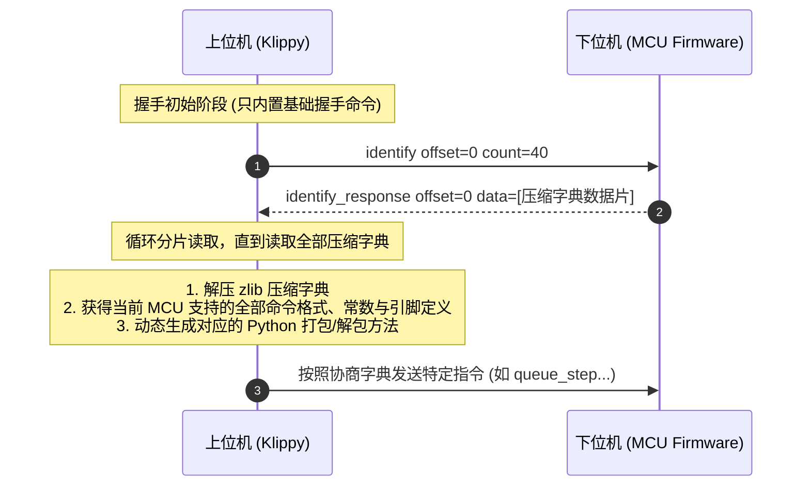

# 1.2 数据字典与极简二进制通信协议

> 许多系统架构往往倒在通信瓶颈上：要么协议过于臃肿导致解析开销爆炸，要么强耦合的静态结构体让上下位机版本更新陷入地狱。Klipper 的通信协议堪称软硬解耦与极致性能兼得的典范。

在传统 3D 打印固件中，上下位机之间通常使用 ASCII 明文的 G-code 进行通信（例如发送 `G1 X100 Y50 F3000`）。这种方式有两大弊端：
1. **带宽浪费严重**：浮点数字符串转换开销巨大，几个数字就要耗费数十个字节。
2. **单片机解析负担重**：单片机需要运行大量的 `strtod`、`strchr` 等字符串解析与浮点转换函数，消耗宝贵的中断与 CPU 时间。

Klipper 彻底摒弃了明文串口交互，自研了一套**自描述数据字典驱动的高效二进制协议**。本节我们将深入 [`klippy/msgproto.py`](file:///home/zxf/workspace/code/agy/book/klipper/klippy/msgproto.py) 与 [`src/command.c`](file:///home/zxf/workspace/code/agy/book/klipper/src/command.c)，剖析这套协议的帧结构、编码黑科技与版本动态协商机制。

---

## 一、 协议帧结构：紧凑且安全的微型报文

在物理传输层（如 USB CDC 虚拟串口、UART 或 CAN 总线），Klipper 将每条报文严格限制在 **64 字节** 以内（刚好贴合常见 USB 全速端点 64 字节的最大包长 `wMaxPacketSize`）。

```text
+----------+----------+----------------------------+-------------+-----------+
| 长度 Len | 序号 Seq |     有效载荷 Payload       | CRC-16 校验 | 同步字 SYNC|
|  (1 Byte)|  (1 Byte)|        (0 ~ 59 Bytes)      |   (2 Bytes) |  (1 Byte) |
+----------+----------+----------------------------+-------------+-----------+
|<---------------------- 计算 CRC 范围 -------------------->|
```

各字段定义见 [`klippy/msgproto.py`](file:///home/zxf/workspace/code/agy/book/klipper/klippy/msgproto.py#L13-L25)：

1. **Length (1 字节)**：记录当前报文的总字节数（从 Length 到 SYNC 字符，范围 5 ~ 64）。
2. **Sequence (1 字节)**：
   * 低 4 位（`0x0F`）：报文滑动窗口序号（0~15），上位机与 MCU 各自维护接收与确认序列号，实现丢包检测与滑动窗口重传。
   * 高位标志：指示报文方向与特殊控制标志。
3. **Payload (0 ~ 59 字节)**：实际命令与其编码后的参数。
4. **CRC-16 CCITT (2 字节)**：覆盖从 Length 到 Payload 尾部的硬件级循环冗余校验码，算法见 [`klippy/msgproto.py`](file:///home/zxf/workspace/code/agy/book/klipper/klippy/msgproto.py#L29-L35)。只要有 1 比特传输翻转，立刻在物理层静默丢弃。
5. **SYNC (1 字节)**：固定为 `0x7E`（即标准 HDLC 同步帧头/尾标志）。如果通信链路遭遇乱码或断线重连，接收端只需快速滑动查找到 `0x7E` 即可瞬间恢复对齐。

---

## 二、 变长整型压缩（Variable-Length Quantity, VLQ）

在 3D 打印控制中，指令包含了大量的步进数、时钟计数和引脚编号。
* 步进电机移动几十步时，数值往往只有 `10`、`50`；
* 时钟计数则可能高达几千万。

如果所有整型都统一用 32 位（4 字节）传输，在小步长时会产生巨大的带宽浪费。为此，Klipper 借鉴并优化了类似 LEB128 的变长整型压缩算法。

在 [`klippy/msgproto.py`](file:///home/zxf/workspace/code/agy/book/klipper/klippy/msgproto.py#L42-L47) 中，`PT_uint32` 的编码极为精巧：

```python
# klippy/msgproto.py
def encode(self, out, v):
    if v >= 0xc000000 or v < -0x4000000: out.append((v>>28) & 0x7f | 0x80)
    if v >= 0x180000 or v < -0x80000:    out.append((v>>21) & 0x7f | 0x80)
    if v >= 0x3000 or v < -0x1000:       out.append((v>>14) & 0x7f | 0x80)
    if v >= 0x60 or v < -0x20:           out.append((v>>7)  & 0x7f | 0x80)
    out.append(v & 0x7f)
```

### 编码特点：
* **小整数单字节**：如果数字在 `-32 ~ 95` 范围内，仅需 **1 个字节** 即可存储！
* **连续位指示**：高位（MSB `0x80`）为 1 表示后续仍有数据字节；最后一个字节的最高位为 0，作为结束标志。
* **支持符号扩展**：巧妙地在 7 位掩码中保留了符号特征，无需额外的符号位标记。

在 MCU 这一端（[`src/command.c`](file:///home/zxf/workspace/code/agy/book/klipper/src/command.c)），解码变长整型仅需要一条极快的 `while` 循环和位移操作，比解析 ASCII 字符串快出几个数量级，且完全杜绝了栈溢出风险。

---

## 三、 数据字典驱动：免固件重新编译的动态绑定

通常在 C 语言通信项目中，两端通信需要共享一套固定的 `struct` 定义。一旦固件增加一个传感器或修改一个参数，上位机和下位机必须重新同步编译并刷写，否则内存偏移一旦对错就会发生野指针或崩溃。

**Klipper 采用了一套极为高级的“数据字典（Data Dictionary）自协商”机制：**



### 1. 固件编译期的符号抽取
在编译 MCU 固件时，Klipper 的构建脚本会扫描所有 C 文件中的宏声明，例如：
```c
// 声明一条 MCU 指令及其参数类型
DECL_COMMAND(command_config_stepper, "config_stepper oid=%c step_pin=%c dir_pin=%c");
```
编译系统自动将所有命令的原型签名收集起来，生成一个 JSON 格式的字典并用 `zlib` 压缩，直接固化在 MCU 的 Flash 尾部。

### 2. 上位机运行时的动态解释
当 Klippy 启动时，它首先发送固定的 `identify` 指令从 MCU 的 Flash 中读取出这份压缩字典。
解压后，Klippy 知道了：
* 命令 `config_stepper` 对应的报文 ID 是多少；
* 每一个参数的数据类型（如 `%c` 为单字节 uint8，`%u` 为变长 uint32，`%.*s` 为动态长度字节串）；
* MCU 编译时的常量（例如 `CLOCK_FREQ`、定时器预分频系数等）。

随后，Klippy 会在内存中**动态构建**对应的打包（Encoder）和解包（Decoder）函数。

这意味着：**上位机可以在不重启、不修改代码的情况下，同时与运行着不同主频、不同芯片（一个 STM32 搭配一个 RP2040）甚至不同功能特性的多个 MCU 进行无缝通信！**

---

## 小结

Klipper 的通信协议通过以下四重设计，在资源极限与灵活性之间取得了最佳平衡：
1. **64 字节微报文**：原生匹配硬件端点传输特性；
2. **CRC-16 与滑动窗口**：在底层构建不可篡改、防乱序的可靠通道；
3. **VLQ 变长整型压缩**：最小化高频运动指令的传输开销；
4. **自描述数据字典**：上下位机解耦，支持跨版本异构多节点动态协同。

有了这条坚实的通信动脉，上位机与下位机便可以开始建立时空桥梁——在下一节中，我们将推导 Klipper 如何利用这套协议驯服物理晶振的时钟漂移。
