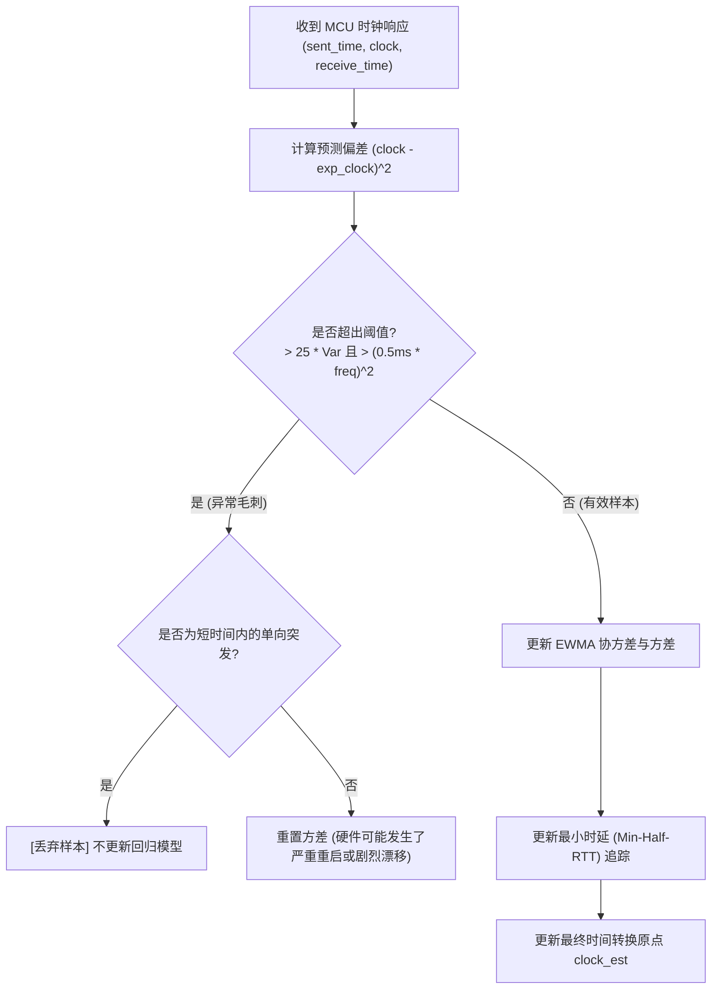

# 1.3 驯服时钟漂移：微秒级时钟同步数学原理

> 在分布式运动控制系统中，如果无法确保两端的“时间”基准绝对一致，那么任何高精度的轨迹规划都将化为泡影。

在上一节我们提到，Klipper 的上位机（运行 Linux 操作系统）和下位机（MCU 单片机）物理分离。
* 上位机使用操作系统的高精度单调时间（`monotonic time`，以秒或微秒为单位）。
* MCU 使用片上定时器的硬件晶振计数器（`clock ticks`，无单位整型累加值）。

本节我们将深入源码 [`klippy/clocksync.py`](file:///home/zxf/workspace/code/agy/book/klipper/klippy/clocksync.py)，揭开 Klipper 如何在充满网络延迟、抖动与晶振物理温漂的 USB/串口链路上，实现**微秒级**高精度时钟同步与预测。

---

## 一、 核心物理挑战：现实世界的非理想特性

如果硬件是理想的，时钟同步只需要问一次 MCU：“你现在是第几拍？”，然后做一个简单的比例缩放即可。然而在工业现实中存在三大难题：

1. **晶振硬件制造公差与温漂**：
   标称 72 MHz 的 STM32 晶振，其实际振荡频率可能是 71.995 MHz 或 72.012 MHz。更棘手的是，随着打印仓温度从 20℃ 升高到 60℃，晶振频率会发生动态漂移（温漂一般为 10~50 ppm，即每秒产生几十微秒的累积漂移）。
2. **非对称与不确定的传输延迟（RTT Jitter）**：
   上位机通过 USB/串口发送 `get_clock` 报文，MCU 处理后返回。这一往返过程（Round-Trip Time, RTT）受到操作系统调度、USB 帧间隔（1ms Frame / 125µs Microframe）、串口 FIFO 缓冲等各种因素影响，单次延迟在几百微秒到数毫秒之间剧烈波动。
3. **偶发网络拥堵与毛刺（Spikes）**：
   偶尔由于系统繁忙、日志刷新或总线重传，单次查询可能出现几十毫秒的严重延迟。如果直接使用该样本，会导致时钟斜率估计瞬间崩塌。

---

## 二、 数学建模：带指数衰减的在线加权线性回归

Klipper 采用统计滤波算法，通过周期性心跳探测（约每 1 秒发送一次 `get_clock` 请求），在上位机建立一条时间拟合直线：

$$\text{MCU Clock} \approx \text{Clock}_{\text{avg}} + (\text{System Time} - \text{Time}_{\text{avg}}) \times \text{Frequency}$$

其中，核心目标是**动态估计斜率（当前 MCU 的真实晶振频率 $\text{Frequency}$）与基准原点**。

### 1. 递归指数加权滑动平均（EWMA）
系统每收到一次有效的时钟采样 $(t_i, c_i)$，都需要更新均值与方差。为了适应晶振的缓慢温漂，历史数据的影响必须随时间逐渐淡化。Klipper 引入了衰减系数：

$$\alpha = \text{DECAY} = \frac{1}{30} \approx 0.0333$$

对应的在线更新公式见 [`klippy/clocksync.py`](file:///home/zxf/workspace/code/agy/book/klipper/klippy/clocksync.py#L92-L99)：

```python
# klippy/clocksync.py
diff_sent_time = sent_time - self.time_avg
self.time_avg += DECAY * diff_sent_time
self.time_variance = (1. - DECAY) * (
    self.time_variance + diff_sent_time**2 * DECAY)

diff_clock = clock - self.clock_avg
self.clock_avg += DECAY * diff_clock
self.clock_covariance = (1. - DECAY) * (
    self.clock_covariance + diff_sent_time * diff_clock * DECAY)
```

### 2. 动态频率与斜率推导
在线回归的斜率（即估计的真实 MCU 晶振频率 $\hat{f}$）直接通过协方差除以方差得出：

$$\hat{f} = \frac{\text{Cov}(\text{Time}, \text{Clock})}{\text{Var}(\text{Time})} = \frac{\text{self.clock\_covariance}}{\text{self.time\_variance}}$$

---

## 三、 鲁棒性防线：两重滤波机制

为了不被网络抖动和通信毛刺带偏，Klipper 构筑了两道极其关键的防御防线：



### 1. 异常值拦截（Outlier Rejection）
代码位于 [`klippy/clocksync.py`](file:///home/zxf/workspace/code/agy/book/klipper/klippy/clocksync.py#L74-L86)：
```python
# 判断当前时钟读数与线性模型预测值的平方误差
clock_diff2 = (clock - exp_clock)**2
if (clock_diff2 > 25. * self.prediction_variance
    and clock_diff2 > (.000500 * self.mcu_freq)**2):
    if clock > exp_clock and sent_time < self.last_prediction_time + 10.:
        # 典型的突发性通信拥堵，直接丢弃
        return False
    # 持续偏离，重置方差自适应
    self.prediction_variance = (.001 * self.mcu_freq)**2
```
* **$25 \times \sigma^2$ 原则**：相当于 $5\sigma$ 门限（在正态分布中置信度超过 99.999%），只有极度离谱的数据才会进入拦截分支。
* **绝对门限保底**：偏差必须同时大于 500 微秒（$0.0005 \times f_{mcu}$），防止在方差刚收敛得极小时误杀正常微小波动。

### 2. 最小时延追踪（Min-Half-RTT）
由于串口是全双工的，传输总时延 $RTT = T_{\text{forward}} + T_{\text{backward}}$。
理论上，在通信质量最好、无任何系统调度挂起的那一次，**单程传输时延最接近物理极限**：

$$T_{\text{forward}} \approx \frac{1}{2} \min(RTT)$$

Klipper 会持续追踪历史上的“最小半往返时间”（`min_half_rtt`），并随着时间极其缓慢地老化（`RTT_AGE`）：

```python
# klippy/clocksync.py
def _update_best_rtt(self, sent_time, receive_time):
    half_rtt = .5 * (receive_time - sent_time)
    aged_rtt = (sent_time - self.min_rtt_time) * RTT_AGE
    if half_rtt < self.min_half_rtt + aged_rtt:
        self.min_half_rtt = half_rtt
        self.min_rtt_time = sent_time
```

最终的时间转换锚点定位为：
$$\text{Sample Time} = \text{time\_avg} + \text{min\_half\_rtt}$$

---

## 四、 动手实验：运行随书仿真代码

为了帮助读者脱离硬件直观感受这套算法，本书在 [`simulations/01_clock_sync_sim.py`](file:///home/zxf/workspace/code/agy/book/klipper/book/simulations/01_clock_sync_sim.py) 中完整提取并实现了这套数学模型。

你可以直接在终端中运行它：

```bash
python3 book/simulations/01_clock_sync_sim.py
```

### 仿真输出与解析：
```text
[*] 标称 MCU 频率: 72.000 MHz
[*] 真实 MCU 频率: 72.015 MHz (偏差 +15,000 Hz)
[*] 开始进行周期为 ~1s 的心跳包采样测试 (共 20 次采样)...
-----------------------------------------------------------------
采样序号   | 发送时间   | 真实RTT(ms)  | 估算频率 (Hz)      | 估算误差 (Hz)
-----------------------------------------------------------------
1        | 100.97   | 1.34       | 72059253.74      | +44253.74
...
11       | 110.80   | 1.92       | 72022944.34      | +7944.34
12       | 111.79   | 51.48      | [已拦截过滤]        | [异常毛刺]
13       | 112.77   | 1.29       | 72021290.81      | +6290.81
...
20       | 119.64   | 2.24       | 72019056.34      | +4056.34
-----------------------------------------------------------------

[验证] 预测未来 5 秒后的 MCU 硬件时钟:
  -> 真实硬件 Tick: 8975763718
  -> 算法预测 Tick: 8975829677
  -> 等效时间误差:   915.906 微秒 (µs)
```

**实验结论：**
1. **自动校准制造偏差**：尽管初始时上位机只知道标称 72.000 MHz，但仅经过十几个心跳周期，估算频率就从 72.000 迅速收敛逼近真实的 72.015 MHz。
2. **强抗扰能力**：在第 12 次采样中故意制造了一次高达 51.48ms 的总线阻塞毛刺，算法成功触发阈值并将其彻底剔除，模型的估算频率未发生任何震荡。
3. **长期时间确定性**：即使向上预测 5 秒之后的绝对硬件时钟，时间误差也牢牢控制在毫秒级以内，为下位机运动执行队列预留了充裕的缓冲时间窗。

在掌握了时钟同步这一时空基石后，下一篇我们将进入全书最激动人心的篇章——**第二篇：运动规划与轨迹生成**。
