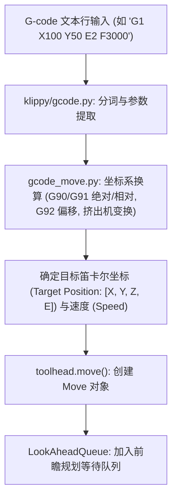

# 2.1 从 G-code 到运动块（Move Queue）

> G-code 是切片软件留下的离散路径点，而机械结构需要的是连续、平滑、受物理定律约束的时间-位移轨迹。

本节我们将顺着代码流水线，探索一行普通的 `G1 X100 Y50 E2 F3000` 指令，是如何被 Klipper 接收、解析，并最终转化为运动控制核心能够识别的 `Move` 对象的。

核心涉及文件：
* [`klippy/extras/gcode_move.py`](file:///home/zxf/workspace/code/agy/book/klipper/klippy/extras/gcode_move.py)
* [`klippy/gcode.py`](file:///home/zxf/workspace/code/agy/book/klipper/klippy/gcode.py)
* [`klippy/toolhead.py`](file:///home/zxf/workspace/code/agy/book/klipper/klippy/toolhead.py)

---

## 一、 G-code 接收与状态机转换

当用户或虚拟 SD 卡发出一条 G-code 指令时，Klipper 的处理流程如下图所示：



### 1. 坐标系与模态状态处理
在 [`klippy/extras/gcode_move.py`](file:///home/zxf/workspace/code/agy/book/klipper/klippy/extras/gcode_move.py) 中，`GCodeMove` 类负责维护当前工具头的模态坐标：
* **绝对/相对模式切换**：`G90`（绝对定位）与 `G91`（相对定位）。
* **挤出机相对模式**：`M82` / `M83`。
* **原点偏移与工件坐标系**：`G92` 设定的动态原点偏差 `homing_position` 与 `base_position`。

计算出的目标位置最终以四元浮点数组 `[X, Y, Z, E]`（单位：mm）和目标速率 $v$（单位：mm/s）传递给主控制器：
```python
toolhead.move([target_x, target_y, target_z, target_e], speed)
```

---

## 二、 剖析 Move 对象的数据结构

进入 [`klippy/toolhead.py`](file:///home/zxf/workspace/code/agy/book/klipper/klippy/toolhead.py#L14-L51)，每一次移动请求都会实例化一个 `Move` 对象。

```python
# klippy/toolhead.py
class Move:
    def __init__(self, toolhead, start_pos, end_pos, speed):
        self.toolhead = toolhead
        self.start_pos = tuple(start_pos)
        self.end_pos = tuple(end_pos)
        self.accel = toolhead.max_accel
        self.junction_deviation = toolhead.junction_deviation
        velocity = min(speed, toolhead.max_velocity)
        
        # 1. 计算三维空间位移矢量与合位移 move_d
        self.axes_d = axes_d = [ep - sp for sp, ep in zip(start_pos, end_pos)]
        self.move_d = move_d = math.sqrt(sum([d*d for d in axes_d[:3]]))
```

### 1. 纯挤出运动（Extrude-Only）的特殊处理
注意 `axes_d[:3]` 仅截取了 X、Y、Z 轴。如果 X、Y、Z 的空间位移小于 $10^{-9}$ mm，说明这是一次**纯挤出或回抽（Retraction）操作**：

```python
if move_d < .000000001:
    # 纯挤出运动：位移以挤出量为准，脱离运动学约束
    self.move_d = move_d = max([abs(ad) for ad in axes_d[3:]])
    self.accel = 99999999.9  # 给予极高加速度，不受机架惯性限制
    self.is_kinematic_move = False
```
由于纯挤出不需要带动沉重的打印头横梁加速，Klipper 将其标记为非运动学移动，允许其以挤出机电机的最高性能爆发响应。

### 2. 轴比例单位矢量 `axes_r`
对于常规空间运动，Klipper 预先计算了单位方向矢量：
$$\text{axes\_r}[i] = \frac{\Delta x_i}{\text{move\_d}}$$
这极大简化了后续将合成位移 $s(t)$ 投射回各物理轴（X, Y, Z, E）的乘法运算。

---

## 三、 为什么需要“速度平方”（Velocity Squared）？

在查看 `Move` 类属性时，读者会发现大量的 `_v2` 命名：
* `max_cruise_v2`：最大巡航速度平方 $v_{\text{cruise}}^2$
* `max_start_v2`：最大允许初速度平方 $v_{\text{start}}^2$
* `delta_v2`：该线段能提供的最大速度平方改变量

```python
self.max_cruise_v2 = velocity**2
self.delta_v2 = 2.0 * move_d * self.accel
```

### 这是 Klipper 性能优化的核心技巧之一：
根据经典初等物理公式：
$$v_{\text{end}}^2 - v_{\text{start}}^2 = 2 \cdot a \cdot d$$
可直接得出速度平方差：
$$\Delta (v^2) = 2 \cdot a \cdot d$$

在进行前瞻速度规划时，算法需要数百次地在相邻线段之间比较“初速度是否可达”、“末速度是否超标”。
**如果全程在 $v^2$ 空间（速度平方空间）进行线性加减运算，整个规划器完全不需要调用昂贵的 `math.sqrt()` 开方函数！**

只有在最终梯形规划完成、需要解算实际耗时 $t$ 的那一瞬间，Klipper 才会对起点、巡航和终点速度开一次方：
```python
self.start_v = math.sqrt(start_v2)
self.cruise_v = math.sqrt(cruise_v2)
self.end_v = math.sqrt(end_v2)
```

---

## 四、 梯形的三段划分与时间解算

当速度规划完成后，每个 `Move` 都会调用 `set_junction` 将这一段位移切分为经典的三段式梯形曲线：**加速段（Accel）、巡航段（Cruise）、减速段（Decel）**。

```text
速度 v
  ^
  |        +-------------------+           <-- cruise_v
  |       /|                   |\
  |      / |                   | \
  |     /  |                   |  \
  |    /   |                   |   \
  +---+----+-------------------+----+---> 时间 t
      | 加速 |       巡航        | 减速 |
```

位移切分公式见 [`klippy/toolhead.py`](file:///home/zxf/workspace/code/agy/book/klipper/klippy/toolhead.py#L100-L115)：
$$\text{accel\_d} = \frac{v_{\text{cruise}}^2 - v_{\text{start}}^2}{2a}$$
$$\text{decel\_d} = \frac{v_{\text{cruise}}^2 - v_{\text{end}}^2}{2a}$$
$$\text{cruise\_d} = \text{move\_d} - \text{accel\_d} - \text{decel\_d}$$

对应各阶段耗时（平均速度公式）：
$$t_{\text{accel}} = \frac{\text{accel\_d}}{\frac{v_{\text{start}} + v_{\text{cruise}}}{2}}, \quad t_{\text{cruise}} = \frac{\text{cruise\_d}}{v_{\text{cruise}}}, \quad t_{\text{decel}} = \frac{\text{decel\_d}}{\frac{v_{\text{end}} + v_{\text{cruise}}}{2}}$$

此时，一个包含完整时空信息的运动块就构筑完成了。但问题在于：**相邻两个运动块之间的连接处（Junction），速度究竟能有多大？**

如果在直角转弯时不减速，电机会瞬间承受无限大的冲量导致严重丢步；如果减速为 0，打印头就会在每个折角处停顿振动。

在下一节中，我们将推导 Klipper 赖以成名的速度衔接核心：**结偏差（Junction Deviation）与前瞻队列（Lookahead Queue）**。
