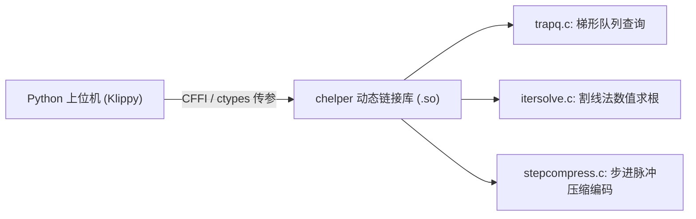

# 3.2 迭代步进求解器（itersolve）原理与 C 扩展加速

> 传统数控固件的思路是“顺推”：按时间推算位移；而 Klipper 的核心思路是“逆解”：指定离散空间刻度，反向精确求解时间。

步进电机本质上是一台**空间角位移量化器**。例如一颗 1.8° 步距角、16 微步细分的电机，其转子每旋转一整周都需要经历严格的 $200 \times 16 = 3200$ 个微步。反映在线性导轨上，每一个步进脉冲对应着一个极微小的固定位移 $\Delta s = \text{step\_dist}$（例如 0.005 mm）。

**步进脉冲生成的本质数学问题是：**
> 给定一个电机的任意空间位置函数 $P(t)$，如何找出所有的精确时间戳序列 $t_0, t_1, t_2, \dots, t_k$，使得：
> $$P(t_k) = k \cdot \text{step\_dist}$$

在非线性机架（如 Delta）或者叠加了高级振动滤波（如 Input Shaping）之后，$P(t)$ 往往是一个高阶甚至分段超越函数，根本不存在代数闭式反函数 $t = P^{-1}(x)$。

Klipper 的解决方案是在 C 语言扩展中构建了一个通用的高数值精度求根求解器——**`itersolve`**。

核心代码见：[`klippy/chelper/itersolve.c`](file:///home/zxf/workspace/code/agy/book/klipper/klippy/chelper/itersolve.c)。

---

## 一、 数值求根：割线法（Secant Method）与二分法托底

为了求出 $P(t) - \text{Target} = 0$ 的根，牛顿迭代法（Newton-Raphson）虽然收敛很快，但需要计算解析导数 $P'(t)$（即速度）。然而许多运动学（如带共振滤波的轨迹）求导过于繁重。

Klipper 选用了**割线法（Secant Method）**结合**二分法（Bisection Method）**的混合求根策略。

```text
位置 P
  ^
  |                     / (实际连续位移曲线 P(t))
  |      Target ----+--/-----+------------------
  |                /  * <--- 真实根点 (精确出步时间)
  |               /  /
  |              /  / 割线近似
  |             /  /
  |            /  /
  +-----------+--+------------------------> 时间 t
            t_old  t_guess
```

在 [`klippy/chelper/itersolve.c`](file:///home/zxf/workspace/code/agy/book/klipper/klippy/chelper/itersolve.c#L46-L75) 中，核心迭代循环如下：

```c
// klippy/chelper/itersolve.c
for (;;) {
    // 1. 利用前后两次猜测点 (old_guess, guess) 构造割线方程，预测下一个时间点
    double guess_dist = guess.position - target;
    double og_dist = old_guess.position - target;
    double next_time = ((old_guess.time * guess_dist - guess.time * og_dist)
                        / (guess_dist - og_dist));

    // 2. 边界安全性检查：如果割线预测点越界或者产生 NaN
    if (!(next_time > low_time && next_time < high_time)) {
        if (have_bracket) {
            // 预测不良，平滑退化为绝对安全的区间二分法
            next_time = (low_time + high_time) * .5;
            check_oscillate = 0;
        } else if (guess.time >= end) {
            // 在当前时间窗口内已没有更多步进脉冲
            break;
        }
    }
    ...
}
```

### 算法数学特性：
* **超线性收敛（Superlinear Convergence）**：割线法的收敛阶数约为 $\phi = \frac{1+\sqrt{5}}{2} \approx 1.618$（黄金分割比），在平滑轨迹上通常只需 2~3 次迭代就能将时间误差收敛到纳秒级（$< 10^{-9}\text{ s}$）。
* **二分法保底（Bracket Safeguard）**：当轨迹遇到剧烈的反向拐点导致割线斜率接近 0（分母接近 0）时，算法自动检测到越界并退化为二分法，保证了 100% 的数值收敛确定性，绝对不会发生死循环。

---

## 二、 换向死区与半步滞后（Hysteresis）

在机械运动中，当轴从正向旋转转为反向旋转时，如果在换向点附近由于浮点舍入产生极其微小的往复抖动，会导致电机在微米尺度上疯狂发出无意义的正反向脉冲。

为了彻底消除这种数值振荡，`itersolve` 引入了**半步触发滞后机制（Half-Step Hysteresis）**：

```c
// klippy/chelper/itersolve.c
double half_step = .5 * sk->step_dist;
double target = sk->commanded_pos + (sdir ? half_step : -half_step);
```

* 电机只有在真实位移突破当前设定位置的**正负半步阈值**之后，才会真正判定换向并触发步进事件；
* 这不仅在软件层面天然提供了抗机械齿隙（Backlash）的鲁棒性，还极大降低了电机反向瞬间的电流应力。

---

## 三、 C 语言扩展（`chelper`）的高性能架构

步进求解是整个上位机计算密度最高的核心。以打印一个复杂模型为例，每秒可能产生超过数十万个微步脉冲。如果纯用 Python 解释执行割线法循环，CPU 占用率将不堪重负。

Klipper 设计了极度轻量的 C 语言加速扩展体系（`klippy/chelper/`）：



* **零拷贝内存交互**：梯形运动块队列（`trapq`）直接在 C 内存空间中分配链表，Python 仅持有指向 C 结构体的指针。
* **批量执行**：Python 端每次调用 `itersolve_generate_steps` 都会批量计算未来数百毫秒内的所有步进脉冲，解算完成后直接就地送入 `stepcompress` 压缩器，整个过程完全绕过了 Python 的全局解释器锁（GIL）与对象装箱拆箱开销。

求解出来的离散脉冲时间戳，接下来是如何被高效压缩并发送给 MCU 的呢？
在下一节中，我们将剖析 Klipper 的专利级创新——**步进序列压缩算法（Step Compression）**。
