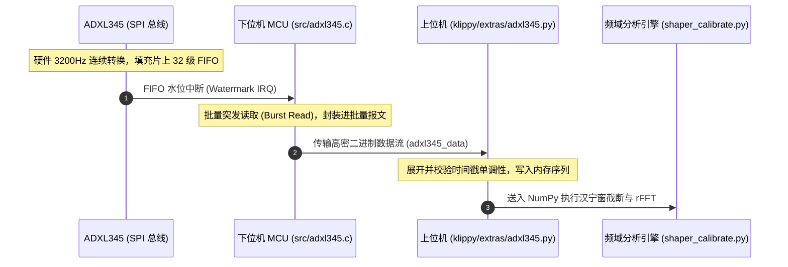

# 4.3 ADXL345 采样流水线与 FFT 频谱估算

> 现代控制系统的灵魂在于“可观测性”。要消灭机架的振动，首先必须精准度量它。

在上一节，我们推导了输入整形器的参数完全取决于机架的**固有共振频率 $f_n$ 与阻尼比 $\zeta$**。
早期用户只能通过肉眼拿着卡尺去量打印立方体表面振纹的间距来反推频率，这种方法不仅耗时繁琐，而且主观误差极大。

Klipper 开创性地将 MEMS 数字加速度计（如 ADXL345）直接集成到固件闭环校准体系中：通过让机床执行**扫频激振测试（Swept-Sine Vibration Test）**，实时采集数十万个加速度样点，并利用快速傅里叶变换（FFT）自动推荐最优整形器。

核心代码见：
* 加速度计传感器驱动：[`klippy/extras/adxl345.py`](file:///home/zxf/workspace/code/agy/book/klipper/klippy/extras/adxl345.py)
* 共振校准与 FFT 分析：[`klippy/extras/shaper_calibrate.py`](file:///home/zxf/workspace/code/agy/book/klipper/klippy/extras/shaper_calibrate.py)
* MCU 端 SPI 批量采集中断：[`src/adxl345.c`](file:///home/zxf/workspace/code/agy/book/klipper/src/adxl345.c)

---

## 一、 扫频激振原理（Chirp Excitation）

当用户执行 `TEST_RESONANCES AXIS=X` 指令时，上位机并不做随机乱动，而是驱动该轴执行一段**频率连续攀升的正弦扫频运动（Chirp Signal）**：

$$x_{\text{command}}(t) = A(t) \cdot \sin(2\pi \cdot f(t) \cdot t)$$

其中激励频率 $f(t)$ 从 $5\text{ Hz}$ 线性递增到 $133\text{ Hz}$。
* 当激励频率远离机架固有频率时，打印头只做温和的受迫往复平移；
* 当激励频率精准扫过机架的固有共振区时（例如到达 $48\text{ Hz}$），机械系统发生强烈**共振放大**，ADXL345 传感器会检测到加速度幅值出现陡峭的数倍到数十倍的几何尖峰！

```text
激励频率:  5 Hz ----------> 35 Hz --------> 48 Hz (共振爆发) ---------> 133 Hz
加速度幅值:  --  -  -  -  -  /\  /\  /\   /|/|/|/|/|/|/|\  -  -  -  -  --
```

---

## 二、 传感器高吞吐流水线：从 SPI 到上位机环形缓冲

ADXL345 是一款经典的 3 轴数字加速度计，支持高达 **$3200\text{ Hz}$** 的高频采样。
每秒产生 $3200 \times 3 \times 2\text{ Bytes} \approx 19.2\text{ KB/s}$ 的纯二进制原始数据。



为了不拖垮 MCU 的步进中断，Klipper 在 [`src/adxl345.c`](file:///home/zxf/workspace/code/agy/book/klipper/src/adxl345.c) 中利用了 ADXL345 的硬件 FIFO 水位中断：
MCU 并不是每来一个样本就中断一次，而是等到传感器内部缓冲了若干样本后，使用高速硬件 SPI 执行一次**突发连续读取（Burst Read）**，并打包成批量报文，以极低的 CPU 开销将原始加速度数据泵送至上位机。

---

## 三、 频域分析：汉宁窗（Hanning Window）与功率谱密度（PSD）

在 [`klippy/extras/shaper_calibrate.py`](file:///home/zxf/workspace/code/agy/book/klipper/klippy/extras/shaper_calibrate.py) 中，上位机收到这批离散加速度时序信号 $a[n]$ 后，开始进入信号处理流水线：

### 1. 加窗截断与消除频谱泄露
由于离散傅里叶变换假定信号是无限周期循环的，直接截断有限长度的扫频信号会在两端产生跳变，导致严重的**频谱泄露（Spectral Leakage）**。
Klipper 采用标准的**汉宁窗（Hanning Window）**进行时域加权：

$$w[n] = 0.5 - 0.5 \cos\left(\frac{2\pi n}{N-1}\right)$$
$$a_{\text{windowed}}[n] = a[n] \cdot w[n]$$

### 2. 功率谱密度（PSD）估计
随后调用 NumPy 的快速实数傅里叶变换 `np.fft.rfft`，计算系统频响响应的功率谱密度：

$$\text{PSD}(f) = \frac{2}{F_s \sum w[n]^2} |A(f)|^2$$

此时，机械系统的“共振指纹”被完全可视化：横轴是频率（Hz），纵轴是机架响应强度。峰值对应的最高频率点，即为该轴的精确共振频率 $f_n$。

---

## 四、 自动推荐决策树（Auto-Calibrate Engine）

得到机架的真实共振谱线后，`shaper_calibrate.py` 内部会模拟遍历所有的候选输入整形器（ZV, MZV, ZVD, EI, 2Hump-EI），并在每一个频率下计算卷积后的预期残余振动：

```text
算法评分维度：
1. 预测残余振动 (Residual Vibration)：必须低于阈值（如 < 5%）。
2. 转角平滑衰减度 (Smoothing Factor)：整形耗时越长，拐角被削掉变圆的程度越大。
3. 允许最大加速度 (Max Recommended Accel)：根据公式 a_max ≈ 2 * freq / shaper_time 评估。
```

最后，Klipper 会在控制台输出一份极其专业的校准报告：
```text
Fitted shaper 'zv' frequency = 48.2 Hz (vibrations = 1.2%, smoothing ~= 0.068)
To avoid too much smoothing with 'zv', suggested max_accel <= 8200 mm/s^2
Fitted shaper 'mzv' frequency = 45.4 Hz (vibrations = 0.0%, smoothing ~= 0.098)
To avoid too much smoothing with 'mzv', suggested max_accel <= 5600 mm/s^2
Fitted shaper 'zvd' frequency = 46.0 Hz (vibrations = 0.0%, smoothing ~= 0.124)
To avoid too much smoothing with 'zvd', suggested max_accel <= 4300 mm/s^2
...
Recommended shaper_type_x = mzv, shaper_freq_x = 45.4 Hz
```

用户只需输入一条 `SAVE_CONFIG`，这组从真实物理硬件上测出的最优控制参数就会自动写入配置文件，即刻生效！

---

## 小结

至此，上位机（Python + C 扩展）的所有复杂推导、前瞻规划、运动学映射与共振滤波已全部就绪。

所有这些在上位机中被精雕细琢的报文，最终都要被投递到真正的物理硬件端。
在下一篇也是最后一篇——**第五篇：MCU 硬实时微内核**中，我们将潜入最底层，看单片机是如何用纯 C 语言以几微秒的中断延迟将这些数据精准转化为驱动电机的物理电平信号的。
