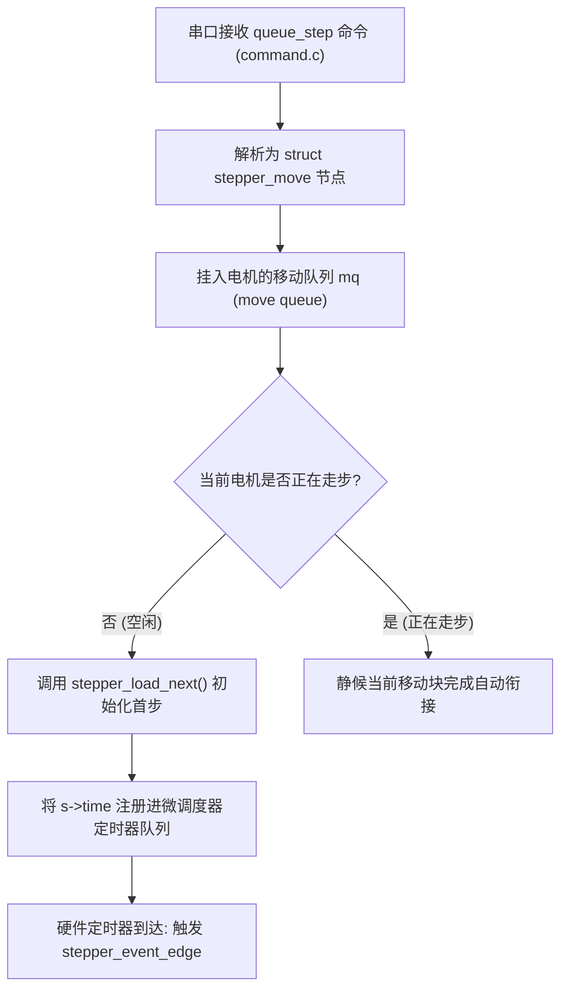

# 5.2 极致精准的步进定时器队列（stepper.c）

> 无论是几十万行的 Python 上位机算法，还是复频域的输入整形滤波器，其最终目的只有一个：让 MCU 这一侧引脚上的方波电平翻转，在时间轴上精确到纳秒。

在 MCU 固件的所有文件中，[`src/stepper.c`](file:///home/zxf/workspace/code/agy/book/klipper/src/stepper.c) 是被调用频率最高、执行时间要求最苛刻的绝对核心。

本节我们将深入这段代码，拆解仅有 6 行汇编级优化的核心中断服务函数，并探讨双沿触发（Both-Edge Stepping）与驱动器时序约束。

---

## 一、 步进电机的执行生命周期

一个 `queue_step` 指令从串口到达 MCU 到最终驱动电机转动，经历以下状态机：



---

## 二、 极限性能：仅 6 行的核心中断回调

当硬件定时器到达指定 Tick 时，中断直接跳入 [`src/stepper.c`](file:///home/zxf/workspace/code/agy/book/klipper/src/stepper.c#L137-L151) 的 `stepper_event_edge`：

```c
// src/stepper.c
static uint_fast8_t
stepper_event_edge(struct timer *t)
{
    // 1. 利用 container_of 宏由定时器节点地址反推母体结构体 stepper
    struct stepper *s = container_of(t, struct stepper, time);

    // 2. 直接翻转 STEP 引脚电平 (硬件寄存器原子写)
    gpio_out_toggle_noirq(s->step_pin);

    // 3. 递减剩余步数
    uint32_t count = s->count - 1;
    if (likely(count)) {
        s->count = count;
        // 4. 计算下一次脉冲的绝对时间点 (一阶差分累加)
        s->time.waketime += s->interval;
        // 5. 更新脉冲间隔 (加速度增量)
        s->interval += s->add;
        // 6. 返回重调度标志，通知内核保留在链表中
        return SF_RESCHEDULE;
    }

    // 本段移动结束，加载队列中的下一个 move_node
    return stepper_load_next(s);
}
```

### 极致优化的工程亮点：
1. **`container_of` 零成本指针解引用**：通过结构体偏移量计算，在编译期被直接优化为单条基址变址加法指令。
2. **`gpio_out_toggle_noirq`**：由于该函数已经处于硬件定时器最高优先级中断服务程序（ISR）中，对 GPIO 的写操作直接向芯片的位设置/清除寄存器（如 STM32 的 `BSRR` / `BRR`）写入数值，不需要关中断，指令周期仅需 **1 ~ 2 个 Clock Cycle**！
3. **`likely(count)` 分支预测宏**：告诉编译器绝大多数情况下步数未耗尽，使主干代码完全按流水线无停顿执行。

在 72MHz 的 ARM Cortex-M3/M4 上，整个 `stepper_event_edge` 的执行时间**不足 0.3 微秒**！
这正是 Klipper 能够在一颗单片机上轻松跑出数十万步每秒极端步频的底层秘密。

---

## 三、 双沿触发优化（Both-Edge Stepping）

传统的驱动器控制模式是：每次走步时，先将 STEP 引脚拉高，延时几个微秒后再拉低，形成一个正脉冲。
这意味着**走一步需要触发两次中断（一次上升沿，一次下降沿）**。

在现代步进驱动芯片（如 Trinamic TMC2209、TMC2240、A4988）中，由于芯片内部检测的是边沿跳变，Klipper 实现了**双沿触发机制（`STEPPER_STEP_BOTH_EDGE`）**：
* 无论是**电平从低变高（上升沿）**，还是**从高变低（下降沿）**，驱动器均判定走一步！
* **硬件中断频率直接降低 50%**，相同 CPU 占用率下，可驱动的电机最高转速瞬间翻倍！

---

## 四、 硬件时序约束：方向改变（DIR）的微秒避让

在步进驱动器的硬件手册中，有一条严格的时序规范：
> **方向建立时间（DIR Hold/Setup Time）**：当 DIR 引脚电平发生跳变后，必须间隔至少 $100 \sim 200\text{ ns}$ 以上，STEP 引脚才能产生下一次有效边沿，否则驱动芯片内部逻辑可能产生误判。

在 [`src/stepper.c`](file:///home/zxf/workspace/code/agy/book/klipper/src/stepper.c#L111-L122) 中，Klipper 针对换向做出了精密避让：

```c
if (was_active && need_dir_change) {
    // 确保 STEP 沿到 DIR 沿之间满足芯片物理时序要求
    gpio_out_toggle_noirq(s->dir_pin);
    uint32_t curtime = timer_read_time();
    min_next_time = curtime + s->step_pulse_ticks;
    if (timer_is_before(s->time.waketime, min_next_time))
        s->time.waketime = min_next_time;
    return SF_RESCHEDULE;
}
```
如果上一步刚完成就要立刻换向，固件会根据当前硬件主频强制将下一次脉冲时间延后 `s->step_pulse_ticks`，从物理电气层面杜绝了高速换向丢步的隐患。

---

## 小结

`stepper.c` 展示了实时嵌入式软件设计的极限平衡：
* 用最简化的差分累加替代复杂的数学运算；
* 用双沿触发减少中断次数；
* 兼顾物理驱动器的纳秒级建立时间要求。

然而，在当今流行的多喷头打印机、工具头板（Toolhead Board）系统中，打印机往往不止一颗单片机——主板控制 XYZ，工具头板控制 E 轴与加速度计。

多个 MCU 是如何通过 CAN 总线或多路 USB 保持绝对同步的？
在下一节中，我们将剖析 **多 MCU 协同与总线同步机制**。
