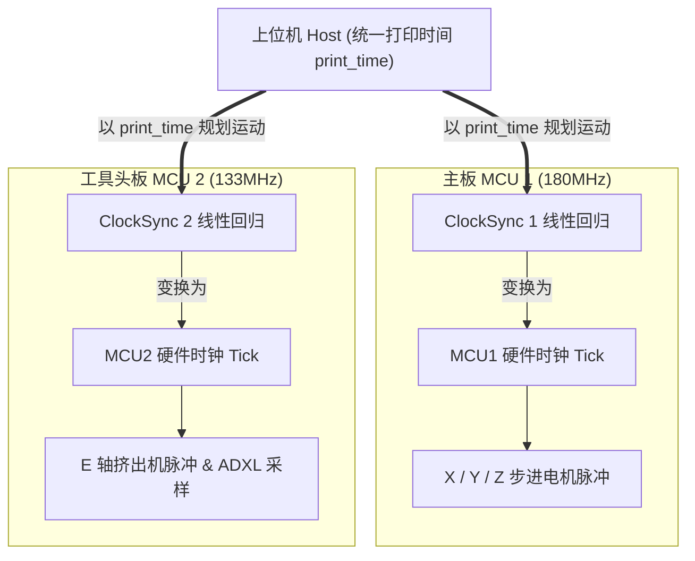

# 5.3 多 MCU 与 CAN 总线异构节点协同

> 传统 3D 打印固件是“单核中央集权”，而 Klipper 天生就是“分布式微服务网络”。

在过去，3D 打印机的走线是一场噩梦：几十根粗细不一的线缆（加热棒、热敏电阻、风扇、步进电机、限位开关、探针）从打印头跨越拖链一路延伸到底部主板，不仅容易疲劳断线，还会增加打印头移动负载。

近几年来，基于 CAN 总线的**工具头板（Toolhead CAN Board）**与多 MCU 架构迅速普及：
* 底部大主板（如 Octopus / Spider）控制 X、Y、Z 轴大电机与热床；
* 喷头上的微型 MCU 板（如 EBB36 / SB2209）仅通过 4 根线（2 根电源线 + 2 根 CAN 差分信号线），就近控制挤出机电机、ADXL345 加速度计与风扇加热。

这种多 MCU 异构组网，在传统固件中几乎无法想象，但在 Klipper 中却是原生支持的基石特性。

核心源码见：
* 上位机多节点调度：[`klippy/mcu.py`](file:///home/zxf/workspace/code/agy/book/klipper/klippy/mcu.py)
* 触发同步器：[`klippy/chelper/steppersync.c`](file:///home/zxf/workspace/code/agy/book/klipper/klippy/chelper/steppersync.c)
* MCU 端硬件触发同步：[`src/trsync.c`](file:///home/zxf/workspace/code/agy/book/klipper/src/trsync.c)

---

## 一、 分布式统一时钟基准：`print_time` 作为时空锚点

在多 MCU 体系中，主板 MCU1（如 STM32F446，180MHz）和工具头 MCU2（如 RP2040，133MHz）使用的是**两颗完全不同、物理独立的外部晶振**，两者的时钟频率不但不相同，而且各自随温度独立漂移。

它们是如何做到动作绝对严丝合缝的？



### 时钟映射原理：
我们在第 1 篇中推导的时钟同步系统再次发挥了核心作用：
上位机以 Linux 的单调时间为媒介，对系统中注册的每一个 `[mcu]` 对象各自维护一个独立的 `ClockSync` 实例。

当上位机规划出一个运动事件：“在未来的 $t = 12.345678\text{ s}$ 时发生位移”：
1. 上位机向 MCU1 发送报文：“请在你的本地时钟 $C_1 = \text{ClockEst}_1(12.345678)$ 触发步进”；
2. 上位机向 MCU2 发送报文：“请在你的本地时钟 $C_2 = \text{ClockEst}_2(12.345678)$ 触发步进”。

两块单片机完全不知道对方的存在，也不需要通过复杂的总线仲裁协议去对表，仅凭上位机的数学时间投影，就实现了微秒级的物理同步！

---

## 二、 跨板急停与触发同步器（Trigger Synchronization, `trsync`）

多 MCU 协同中存在一个极端危险的场景：
> **归零碰瓷或探针触发（Homing & Probing）**：
> 调平探针（如 BLTouch 或微动开关）接在工具头 MCU2 上，而驱动 Z 轴移动的步进电机却连接在主板 MCU1 上。
> 当探针在下降过程中撞到热床触发时，如果上位机通过软件轮询转发消息，几十毫秒的延迟足以让喷嘴把热床撞穿！

为了解决跨板硬实时停止问题，Klipper 设计了**触发同步器（`trsync`）**机制。

### 硬件事件快速收敛机制：
1. **预设触发条件**：在归零移动开始前，上位机分别在 MCU1（电机端）和 MCU2（传感器端）预设 `trsync` 监听对象。
2. **状态快报**：传感器 MCU2 一旦检测到引脚电平跳变，立刻向总线发出最高优先级的紧凑广播报文（Trigger State）。
3. **确定性刹车**：电机主板 MCU1 收到指令后，直接在硬件中断层立即制动步进电机，并记录下触发时的精确时钟 Tick：
   ```c
   // src/trsync.c
   void trsync_do_trigger(struct trsync *ts, uint8_t reason) {
       ts->flags |= TF_TRIGGERED;
       // 停止关联电机的步进定时器
   }
   ```
4. **事后回溯计算**：上位机根据两端记录的精准时钟时间，逆向推算出探针触发瞬间热床的绝对几何坐标，从而实现极高精度的网床调平。

---

## 三、 CAN 总线（SocketCAN）通信吞吐与节流

在 Linux 端，Klipper 原生接入操作系统的 **SocketCAN** 网络协议栈（如 `can0` 接口）。

为了防止突发大量指令造成 CAN 总线 FIFO 溢出或丢帧，Klipper 上位机在底层实现了**报文节流发送（Message Pacing）**与滑动窗口流控：
* 优先保证时钟心跳包（`get_clock`）与急停信号的实时性；
* 运动数据包按预定释放时间（`transmit_time`）在时间线上均匀平滑注入总线，避免了突发洪峰冲击。

---

## 小结

通过分布式统一时钟投影与 `trsync` 快速触发联动，Klipper 将多个分散在物理空间上的微控制器整合成了一台有机协作的“虚拟超级计算机”。

但无论系统设计多么严密，工程实践中总难免出现意外。在所有 Klipper 用户与开发者的使用经历中，最令人闻风丧胆的报错莫过于：
> **`MCU 'mcu' shutdown: Timer too close`**

这个报错的底层真实机理是什么？它为什么会发生？在源码层面我们应该如何定位与解决？

在下一节中，我们将迎来全书的收官之战——**“Timer too close” 终极排查指南**。
