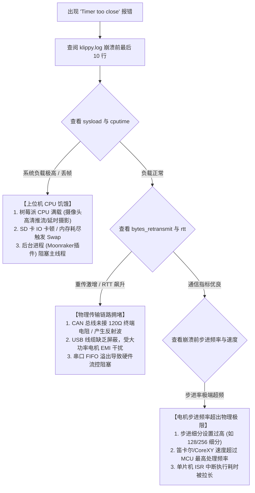

# 5.4 源码诊断实战：“Timer too close” 终极排查指南

> 如果你使用过 Klipper，你大概率经历过打印到 99% 时屏幕突然弹出的红色警报：“MCU 'mcu' shutdown: Timer too close”。这是无数 Klipper 玩家的噩梦，也是最能体现其软硬协同设计本质的经典命题。

网络论坛上关于这个报错的讨论汗牛充栋，许多人将其归咎为“神秘玄学”。但只要翻开源码，你就会发现其背后的物理机理清晰明确、冷酷而严密。

本节我们将以源码为手术刀，彻底解剖“Timer too close”的触发机理，并提供一份工业级的系统排查决策树。

---

## 一、 源码溯源：它究竟在何处被触发？

打开 MCU 微内核调度器源码 [`src/sched.c`](file:///home/zxf/workspace/code/agy/book/klipper/src/sched.c#L85-L107)，寻找 `try_shutdown`：

```c
// src/sched.c
void sched_add_timer(struct timer *add)
{
    uint32_t waketime = add->waketime;
    irqstatus_t flag = irq_save();
    struct timer *tl = SchedStatus.timer_list;

    if (unlikely(timer_is_before(waketime, tl->waketime))) {
        // 当新定时器的触发时间早于当前链表头的所有定时器时
        if (timer_is_before(waketime, timer_read_time()))
            try_shutdown("Timer too close");
        ...
        timer_kick();
    } else {
        insert_timer(tl, add, waketime);
    }
    irq_restore(flag);
}
```

注意这致命的两行：
```c
if (timer_is_before(waketime, timer_read_time()))
    try_shutdown("Timer too close");
```

### 字面含义：
当 MCU 准备把一个新的定时器事件（通常是下一个步进脉冲）装入硬件定时器比较寄存器时，固件读取当前芯片硬件计数器的实时读数 `timer_read_time()`，赫然发现：
$$\text{waketime} < \text{timer\_read\_time()}$$

**上位机要求 MCU 触发脉冲的那个时间点，在现实世界中已经过去成了历史！**

---

## 二、 深度追问：为什么不能“亡羊补牢”立刻执行？

很多初学者会问：“既然这个时间点已经过了几微秒，MCU 为什么不直接当场把它执行掉，反而要直接拉响警报、彻底死机（Shutdown）呢？”

这涉及到微控制器硬件定时器（Hardware Timer Comparator）的物理工作特性：

```text
硬件计数器 CNT:   0 ---------> 1000 ---------> 2000 (当前时间) ------------> 2^32-1
上位机要求时刻:                           1995 (已在过去!)
```

1. **硬件匹配机制**：以常见的 ARM Cortex-M（STM32 / RP2040）或 AVR 为例，硬件定时器是依靠比较寄存器 `CNT == CCR` 相等匹配触发中断的。
2. **回绕灾难（Wraparound）**：如果当前硬件时钟已经是 `2000`，而你把比较寄存器写入 `1995`，硬件定时器在当前周期**永远不会产生匹配**！
3. **长达 1 分钟的“假死”**：计数器必须一路递增到 $2^{32} - 1$（约 42.9 亿），溢出归零后重新数到 1995。在 72MHz 的主频下：
   $$T_{\text{wait}} = \frac{2^{32}}{72 \times 10^6\text{ Hz}} \approx 59.65\text{ 秒}$$
   在这长达将近 1 分钟的漫长等待里，该定时器中断将处于“失联”状态，导致打印机所有轴脉冲彻底锁死。如果此时加热棒处于全功率加热状态，或者喷嘴正在以 300mm/s 冲向机架边缘，这 60 秒的失控足以酿成严重的撞机或火灾！

因此，**立即停机是保证设备与人身安全的唯一正确解**。

---

## 三、 四大根因与全链路排查决策树

为什么上位机发送的时间点会落到过去？
回顾全书的知识体系，从上位机规划到下位机执行，整条链路只要任何一处发生严重延迟，都会耗尽预设的缓冲时间窗（`BUFFER_TIME_START = 0.250s`）：



### 1. 上位机 CPU 饥饿（Host Starvation）
* **诊断特征**：在 `klippy.log` 中搜索 `Stats` 行，若 `sysload` 大于 CPU 核心数，或 `cputime` 接近 1.0。
* **根治手段**：降低 USB 网络摄像头分辨率与帧率（如从 1080P 30fps 降至 720P 15fps）；更换高速 A2 等级 TF 卡，防止 Linux 内核写日志时发生 I/O 挂起。

### 2. 总线信号完整性与干扰（EMI & Bus Errors）
* **诊断特征**：`bytes_retransmit`（重传字节数）在崩溃前呈指数级上升，或 CAN 接口出现大量 `error-warning` / `bus-off`。
* **根治手段**：使用万用表测量 CAN_H 与 CAN_L 之间的静态电阻，确保**整网并联电阻严格等于 $60\ \Omega$**（两端各一个 $120\ \Omega$ 终端电阻）；CAN 线缆与步进电机动力线分槽走线，避免大电流脉冲电磁感应串扰。

### 3. MCU 步进频率过载（MCU Overload）
* **诊断特征**：在极其微小的圆弧切片、密集小折线或超高速空移时频繁复现。
* **根治手段**：将驱动器的物理硬件微步从 64 或 128 降回工业标准的 16 微步（开启 TMC 驱动芯片内部的插值功能 `interpolate: True`，声音同样安静但大幅解放 MCU CPU）。

---

## 全书结语

从一行纯文本的 G-code 指令，到物理芯片引脚上一微秒的电平跳变；
从泊肃叶流体动力学与输入整形的拉普拉斯变换，到哨兵链表与无锁差分微调度器。

Klipper 用一套极其纯粹、优雅而严密的工程架构证明了：
**优秀的系统设计从来不是堆砌更昂贵的硬件，而是用严谨的数学模型重构软硬分工，在受限的物理世界中开辟出极致的性能边界。**

希望通过本书的 16 个深度专题与配套仿真，你不仅彻底掌握了 Klipper 的内核机理，更在分布式实时控制、软硬协同架构与运动算法的广阔世界中，领略到了顶尖嵌入式工程设计的结构之美！
